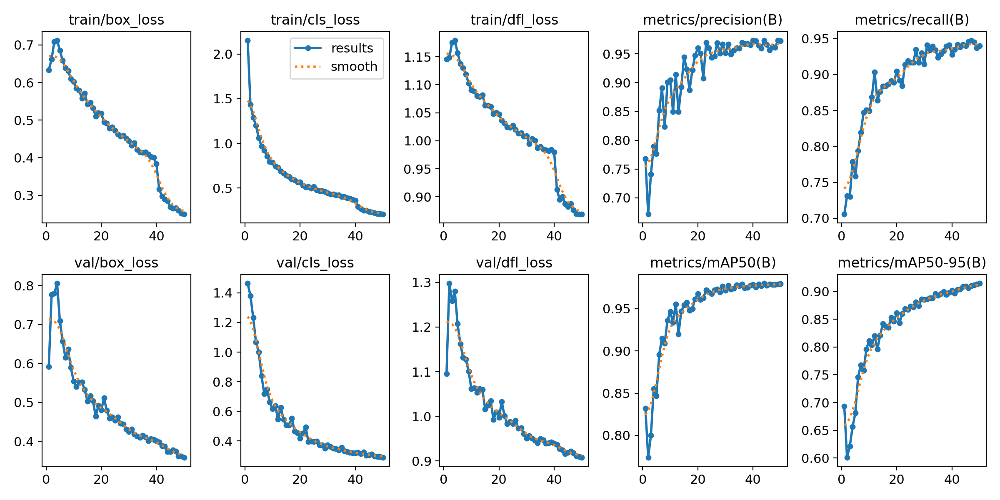

# YOLOv8 Vehicle Detection

This repository contains a fine-tuned YOLOv8 object detection model trained on a 6-class custom vehicle dataset. The dataset includes labeled images of:

-  Car  
-  Threewheel  
-  Bus  
-  Truck  
-  Motorbike  
-  Van

The project demonstrates end-to-end training, evaluation, and visualization using the [Ultralytics YOLOv8](https://github.com/ultralytics/ultralytics) library.

---

## Dataset

The dataset was sourced from [Kaggle](https://www.kaggle.com/datasets/nadinpethiyagoda/vehicle-dataset-for-yolo) and contains over 3,000 images labeled in YOLO format across 6 vehicle classes.

---

## Model

- **Model used**: YOLOv8n (Nano version for fast training/inference)
- **Pretrained weights**: COCO
- **Training**: 50 epochs using Ultralytics trainer
- **Resolution**: 640x640
- **Loss functions**: Combined bounding box, objectness, and classification loss
- **Post-processing**: Non-Maximum Suppression (NMS) applied to remove duplicate predictions

---

## Visualization

The notebook includes per-class qualitative visualizations where each subplot:
- Shows a test image
- Overlays ground truth boxes (green) and model predictions (red)
- Annotates confidence score and IoU per prediction

---

## Training Results

The following plot summarizes the model's training performance over 50 epochs:

-  **Box loss**: measures localization accuracy
-  **Class loss**: penalizes incorrect class predictions
-  **DFL loss**: distribution focal loss for better bounding box regression
-  **Precision/Recall**: how accurate and complete detections are
-  **mAP50 / mAP50-95**: mean Average Precision at IoU thresholds

### Observations:

#### Loss Curves
- `train/box_loss` and `val/box_loss` both decrease steadily, indicating that the model is improving in localizing bounding boxes over time.
- `train/cls_loss` and `val/cls_loss` drop smoothly, showing that class prediction accuracy improves consistently.
- `train/dfl_loss` and `val/dfl_loss`  also decline sharply, which helps the model predict tighter bounding boxes.

All validation losses closely follow training losses, suggesting minimal overfitting and good generalization to the validation set.

#### Precision and Recall
- **Precision** increases from approximately 0.7 to 0.96, indicating fewer false positives over time.
- **Recall** improves from approximately 0.72 to 0.94, meaning the model is detecting a greater proportion of true objects.

#### Mean Average Precision
- **mAP@0.5** (metric/mAP50) improves from around 0.80 to above 0.98, showing excellent detection performance at standard IoU thresholds.
- **mAP@0.5:0.95** (metric/mAP50-95) increases from approximately 0.60 to 0.91, reflecting strong performance under stricter localization accuracy requirements.

---

### Conclusion

The training metrics indicate stable convergence, low loss values, and high detection accuracy. The model demonstrates good fit to the 6-class vehicle detection dataset, with minimal overfitting and strong performance on validation data.

##  Training Environment

- Models were trained using **Google Colab**.
- Hardware accelerator: **NVIDIA T4 GPU** provided by Colab.
- Frameworks: PyTorch (Ultralytics YOLOv8), Torchvision.